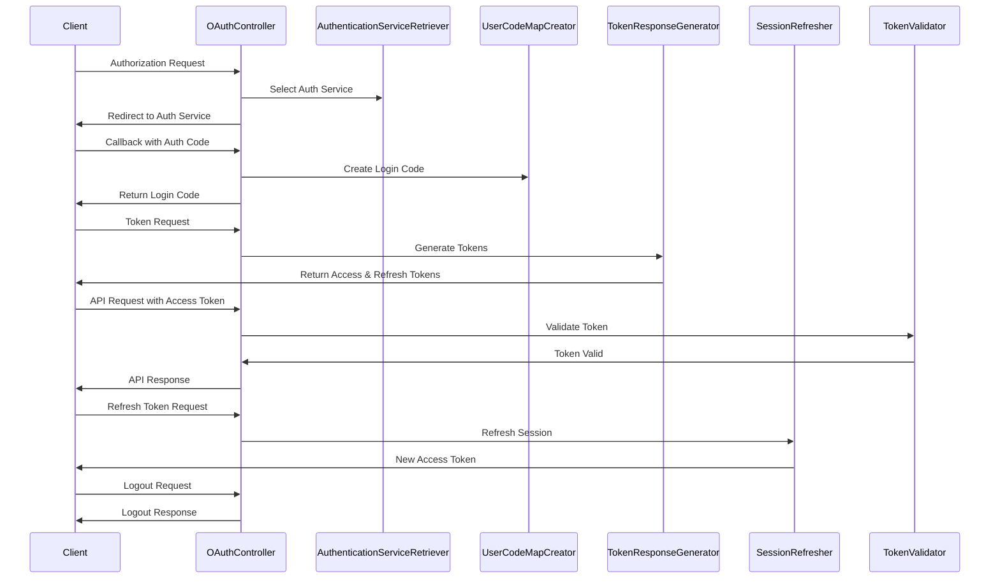

# Custom OAuth 2.0 Server Implementation Documentation

## Overview

This Rails application implements a custom OAuth 2.0 authorization server. It provides authentication and authorization services for client applications, focusing on user verification and session management. The server supports multiple identity providers and offers a flexible, secure OAuth 2.0 implementation.

## Key Components

1. OAuthController
2. TokenValidator
3. AuthenticationServiceRetriever
4. TokenResponseGenerator
5. SessionRefresher
6. UserCodeMapCreator
7. ServiceAccountAccessTokenJwtEncoder
8. UserVerifier
9. OAuthClient (Model)
10. OAuthAccessToken (Model)
11. OAuthRefreshToken (Model)
12. User (Model)

## Authentication Flow

## Detailed Process Description

### 1. Authorization Request

- The client initiates the flow by sending an authorization request to the `/oauth/authorize` endpoint.
- The `OAuthController#authorize` method handles this request.
- It validates the parameters (client_id, redirect_uri, response_type, ACR, operation).
- Creates a state token using `StatePayloadJwtEncoder`.
- Selects the appropriate authentication service using `AuthenticationServiceRetriever`.

### 2. Authentication

- The user is redirected to the selected authentication service.
- The user authenticates with the service.
- The service redirects back to the callback URL.

### 3. Callback Handling

- The `OAuthController#callback` method processes the callback.
- It validates the callback parameters and decodes the state token.
- Retrieves user information from the authentication service.
- Creates a login code using `UserCodeMapCreator`.
- The `UserVerifier` is used to find or create a `UserVerification` record.

### 4. Token Request

- The client exchanges the login code for tokens using the `/oauth/token` endpoint.
- `OAuthController#token` handles this request.
- `TokenResponseGenerator` creates the access and refresh tokens.
- For service accounts, `ServiceAccountAccessTokenJwtEncoder` is used to encode the access token as a JWT.

### 5. Token Validation

- Protected API endpoints use the `TokenValidator` middleware.
- It extracts the access token from the Authorization header.
- Validates the token's authenticity and expiration.

### 6. Token Refresh

- When the access token expires, the client can use the refresh token to get a new access token.
- The `/oauth/refresh` endpoint handles this request.
- `SessionRefresher` validates the refresh token and creates new tokens.

### 7. Logout

- The `/oauth/revoke` endpoint handles logout requests.
- It revokes the session and redirects the user if necessary.

## Key Classes and Their Responsibilities

### OAuthController

- Handles all OAuth-related endpoints (authorize, callback, token, refresh, revoke, logout).
- Manages the overall flow of the OAuth process.

### TokenValidator

- Middleware for validating access tokens on protected routes.
- Checks token authenticity and expiration.

### AuthenticationServiceRetriever

- Selects the appropriate authentication service based on the login type.
- Supports multiple identity providers.

### TokenResponseGenerator

- Generates access and refresh tokens.
- Supports different grant types: authorization code, JWT bearer, and token exchange.

### SessionRefresher

- Handles token refresh process.
- Validates the refresh token and creates new access and refresh tokens.

### UserCodeMapCreator

- Creates a login code after successful authentication.
- Manages user verification and terms of use acceptance.

### ServiceAccountAccessTokenJwtEncoder

- Encodes service account access tokens as JWTs.
- Includes claims like issuer, audience, subject, expiration time, and scopes.

### UserVerifier

- Finds or creates UserVerification records.
- Manages the relationship between user verifications and user accounts.
- Handles different types of identifiers (e.g., email, ID from external providers).

### OAuthClient (Model)

- Represents OAuth clients (applications) authorized to use the OAuth server.
- Stores client_id, client_secret, and redirect_uri.

### OAuthAccessToken (Model)

- Represents access tokens issued to clients.
- Includes token string, expiration time, and associations to client and user.

### OAuthRefreshToken (Model)

- Represents refresh tokens issued to clients.
- Used to obtain new access tokens without re-authentication.

### User (Model)

- Represents end-users of the system.
- Includes authentication logic (e.g., has_secure_password).

## Client Configuration

Client configurations are managed through the `OAuthClient` model. This system allows for detailed and flexible configuration of OAuth clients, including:

- Token durations
- Redirect URIs
- Authentication types
- Shared session settings
- Enforced terms of use
- Service levels
- Supported credential service providers

## Security Measures

1. PKCE (Proof Key for Code Exchange) support for enhanced security with public clients.
2. Anti-CSRF tokens to prevent CSRF attacks.
3. JWT encoding for service account access tokens.
4. Refresh token rotation to detect and prevent token theft.
5. Rate limiting to prevent abuse (using rack-attack).
6. CORS configuration to control cross-origin requests.

## Error Handling

Custom error classes are used throughout the application to handle various error scenarios. These are defined in the `OAuth::Errors` module.

## Logging and Monitoring

A custom logger is used to log important events throughout the authentication process. Consider implementing additional monitoring as the application scales.

## Future Enhancements

1. Implement support for additional grant types.
2. Enhance scope support for more fine-grained access control.
3. Implement additional security measures like dynamic client registration.
4. Add support for federated identity providers.
5. Implement more comprehensive analytics and monitoring.

## Related Files

- `app/controllers/oauth_controller.rb`
- `app/services/authentication_service_retriever.rb`
- `app/services/token_response_generator.rb`
- `app/services/session_refresher.rb`
- `app/services/user_code_map_creator.rb`
- `app/services/service_account_access_token_jwt_encoder.rb`
- `app/services/user_verifier.rb`
- `app/models/oauth_client.rb`
- `app/models/oauth_access_token.rb`
- `app/models/oauth_refresh_token.rb`
- `app/models/user.rb`
- `app/middleware/token_validator.rb`
- `config/routes.rb`

## Getting Started

1. Clone the repository
2. Run `bundle install` to install dependencies
3. Set up the database with `rails db:create db:migrate`
4. Configure your OAuth clients in the database
5. Start the server with `rails server`