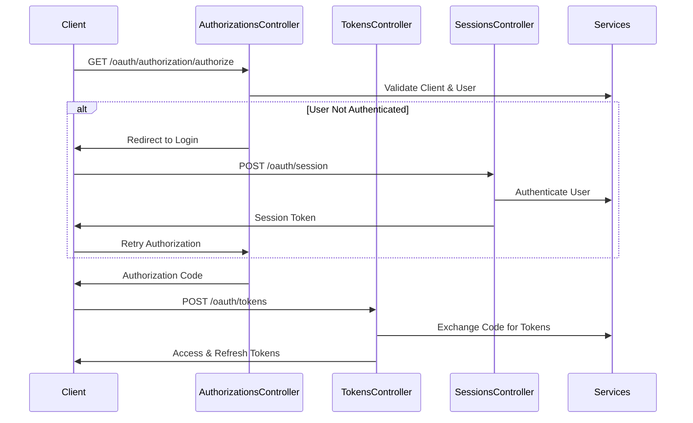

# Custom OAuth 2.0 Server Implementation Documentation

## Overview

This Rails application implements a custom OAuth 2.0 authorization server. It provides authentication and authorization services for client applications, focusing on secure token management and flexible OAuth 2.0 flows.

## Key Components

### Controllers
1. Api::V1::Oauth::AuthorizationsController
   - Handles authorization code flow
   - Manages user authentication state
   - Implements PKCE support

2. Api::V1::Oauth::TokensController
   - Manages token issuance and revocation
   - Supports multiple grant types
   - Handles refresh token flow

3. Api::V1::Oauth::SessionsController
   - Manages user authentication
   - Handles login/logout
   - Maintains OAuth flow state

4. Api::V1::Oauth::UsersController
   - Handles user registration
   - Provides user information
   - Manages user profiles

### Services
1. AuthenticationService
   - Validates tokens
   - Authenticates users and clients
   - Provides token information

2. AuthorizationService
   - Creates authorization codes
   - Validates client and redirect URIs
   - Manages authorization flow

3. TokenService
   - Creates access and refresh tokens
   - Handles token refresh
   - Manages token revocation

4. SessionService
   - Manages user sessions
   - Creates session tokens
   - Handles session destruction

### Models
1. OAuthClient
   - Secure client authentication
   - Client credential management
   - Redirect URI validation

2. AuthorizationCode
   - PKCE support
   - Code expiration
   - Scope management

3. OAuthAccessToken & OAuthRefreshToken
   - Token lifecycle management
   - Scope validation
   - Expiration handling

## Authentication Flow



## API Endpoints

### Authorization Flow
```
# Authorization Request
GET /api/v1/oauth/authorization/authorize
Parameters:
  - client_id: string (required)
  - redirect_uri: string (required)
  - response_type: 'code' (required)
  - scope: string (optional)
  - state: string (recommended)
  - code_challenge: string (required for PKCE)
  - code_challenge_method: string (required for PKCE, 'plain' or 'S256')

# Token Exchange
POST /api/v1/oauth/tokens
Parameters:
  - grant_type: string (required: 'authorization_code', 'refresh_token', or 'client_credentials')
  - client_id: string (required)
  - client_secret: string (required)
  - code: string (required for authorization_code grant)
  - code_verifier: string (required for PKCE)
  - refresh_token: string (required for refresh_token grant)
  - scope: string (optional)

# Token Revocation
POST /api/v1/oauth/tokens/revoke
Parameters:
  - token: string (required)
  - client_id: string (required)
  - client_secret: string (required)
```

### Session Management
```
# Create Session (Login)
POST /api/v1/oauth/session
Parameters:
  - email: string (required)
  - password: string (required)
  - client_id: string (optional)
  - return_to: string (optional)

# End Session (Logout)
DELETE /api/v1/oauth/session
Headers:
  - Authorization: Bearer <access_token>
```

### User Management
```
# Create User (Registration)
POST /api/v1/oauth/users
Parameters:
  - user[email]: string (required)
  - user[password]: string (required)
  - user[password_confirmation]: string (required)
  - user[first_name]: string (required)
  - user[last_name]: string (required)

# Get User Info
GET /api/v1/oauth/users/:id
Headers:
  - Authorization: Bearer <access_token>
```

### Response Formats

#### Success Responses
```json
# Token Response
{
  "access_token": "string",
  "token_type": "Bearer",
  "expires_in": 3600,
  "refresh_token": "string",
  "scope": "read write"
}

# Session Response
{
  "token": "string",
  "redirect_to": "string"
}

# User Response
{
  "id": "integer",
  "email": "string",
  "first_name": "string",
  "last_name": "string"
}
```

#### Error Responses
```json
{
  "error": "error_description"
}

# Authentication Required
{
  "error": "Login required",
  "login_url": "/login?return_to=..."
}
```

### Headers
```
# Required for all authenticated requests
Authorization: Bearer <access_token>

# Required for all requests
Accept: application/json
Content-Type: application/json
```

### CORS Configuration
```
# Allowed Origins
- http://localhost:3000 (development)
- https://your-production-domain.com (production)

# Allowed Methods
- GET
- POST
- PUT
- PATCH
- DELETE
- OPTIONS

# Allowed Headers
- Authorization
- Content-Type
- Accept
```

## Security Features

1. PKCE Support
   - Code challenge validation
   - Multiple challenge methods (plain, S256)

2. Token Security
   - Secure token generation
   - Token expiration
   - Token revocation

3. Session Management
   - Secure cookie storage
   - Session expiration
   - CSRF protection

4. Client Authentication
   - Secure password hashing
   - Client credential validation
   - Redirect URI validation

## Testing

Comprehensive test suite covering:
- Authorization flow
- Token management
- Session handling
- Error cases
- Security validations

## Configuration

### Session Store
```ruby
Rails.application.config.session_store :cookie_store, 
  key: '_oauth_server_session',
  secure: Rails.env.production?,
  expire_after: 30.days
```

### Application Config
```ruby
config.middleware.use ActionDispatch::Cookies
config.middleware.use ActionDispatch::Session::CookieStore
config.api_only = false
```

## Error Handling

Centralized error handling through ErrorHandler concern:
- OAuth-specific errors
- Authentication errors
- Validation errors
- Standard error responses

## Future Enhancements

1. JWT Support
   - Token signing
   - Claims validation
   - Key rotation

2. Enhanced Security
   - Refresh token rotation
   - Rate limiting
   - Scope validation

3. Additional Features
   - Dynamic client registration
   - Token introspection
   - Token revocation events

4. Monitoring
   - Token usage tracking
   - Security event logging
   - Performance metrics

## Contributing

Please read CONTRIBUTING.md for details on our code of conduct and the process for submitting pull requests.

## License

This project is licensed under the MIT License - see the LICENSE.md file for details.

## Frontend Implementation Guide

### 1. Initial OAuth Flow Setup
```javascript
// Example NextJS implementation
const initiateOAuth = async () => {
  const state = generateRandomString(32);
  const codeVerifier = generateRandomString(64);
  const codeChallenge = await generateCodeChallenge(codeVerifier);

  // Store these in session/local storage
  sessionStorage.setItem('oauth_state', state);
  sessionStorage.setItem('code_verifier', codeVerifier);

  const params = new URLSearchParams({
    response_type: 'code',
    client_id: process.env.NEXT_PUBLIC_CLIENT_ID,
    redirect_uri: 'http://localhost:3000/auth/callback',
    code_challenge: codeChallenge,
    code_challenge_method: 'S256',
    state: state,
    scope: 'read write'
  });

  window.location.href = `${process.env.NEXT_PUBLIC_API_URL}/oauth/authorization/authorize?${params}`;
};
```

### 2. Handling the Callback
```javascript
// pages/auth/callback.js
const handleCallback = async () => {
  const { code, state } = router.query;
  
  // Verify state matches
  const savedState = sessionStorage.getItem('oauth_state');
  if (state !== savedState) {
    throw new Error('State mismatch - possible CSRF attack');
  }

  const codeVerifier = sessionStorage.getItem('code_verifier');
  
  const response = await fetch(`${process.env.NEXT_PUBLIC_API_URL}/oauth/tokens`, {
    method: 'POST',
    headers: {
      'Content-Type': 'application/json',
    },
    body: JSON.stringify({
      grant_type: 'authorization_code',
      client_id: process.env.NEXT_PUBLIC_CLIENT_ID,
      client_secret: process.env.NEXT_PUBLIC_CLIENT_SECRET,
      code: code,
      code_verifier: codeVerifier,
    }),
  });

  const data = await response.json();
  // Store tokens securely
  securelyStoreTokens(data);
};
```

### 3. Making Authenticated Requests
```javascript
const apiClient = axios.create({
  baseURL: process.env.NEXT_PUBLIC_API_URL,
  headers: {
    'Content-Type': 'application/json',
  },
});

// Request interceptor
apiClient.interceptors.request.use((config) => {
  const token = getAccessToken();
  if (token) {
    config.headers.Authorization = `Bearer ${token}`;
  }
  return config;
});

// Response interceptor for token refresh
apiClient.interceptors.response.use(
  (response) => response,
  async (error) => {
    if (error.response?.status === 401) {
      try {
        const newTokens = await refreshTokens();
        // Retry original request with new token
        error.config.headers.Authorization = `Bearer ${newTokens.access_token}`;
        return apiClient(error.config);
      } catch (refreshError) {
        // Redirect to login
        window.location.href = '/login';
      }
    }
    return Promise.reject(error);
  }
);
```

### 4. Token Refresh Implementation
```javascript
const refreshTokens = async () => {
  const refreshToken = getRefreshToken();
  
  const response = await fetch(`${process.env.NEXT_PUBLIC_API_URL}/oauth/tokens`, {
    method: 'POST',
    headers: {
      'Content-Type': 'application/json',
    },
    body: JSON.stringify({
      grant_type: 'refresh_token',
      client_id: process.env.NEXT_PUBLIC_CLIENT_ID,
      client_secret: process.env.NEXT_PUBLIC_CLIENT_SECRET,
      refresh_token: refreshToken,
    }),
  });

  const data = await response.json();
  securelyStoreTokens(data);
  return data;
};
```

### 5. Required Environment Variables
```bash
# .env.local
NEXT_PUBLIC_API_URL=http://localhost:4000/api/v1
NEXT_PUBLIC_CLIENT_ID=your_client_id
NEXT_PUBLIC_CLIENT_SECRET=your_client_secret
NEXT_PUBLIC_REDIRECT_URI=http://localhost:3000/auth/callback
```

### 6. Error Handling
```javascript
const handleOAuthError = (error) => {
  if (error.response?.status === 401) {
    if (error.response.data.error === "Login required") {
      // Redirect to login with return URL
      const returnUrl = encodeURIComponent(window.location.href);
      window.location.href = `${error.response.data.login_url}?return_to=${returnUrl}`;
    } else {
      // Handle other authentication errors
      console.error('Authentication error:', error.response.data.error);
    }
  }
};
```

### Security Considerations

1. Token Storage
   - Store access tokens in memory when possible
   - Use secure httpOnly cookies for refresh tokens
   - Never store tokens in localStorage

2. PKCE Implementation
   - Always use 'S256' method in production
   - Generate secure random strings for verifier
   - Verify state parameter matches

3. Error Handling
   - Implement proper error boundaries
   - Handle token refresh failures gracefully
   - Provide user-friendly error messages

4. CORS Considerations
   - Ensure your frontend origin is allowed
   - Include proper headers in requests
   - Handle preflight requests correctly
