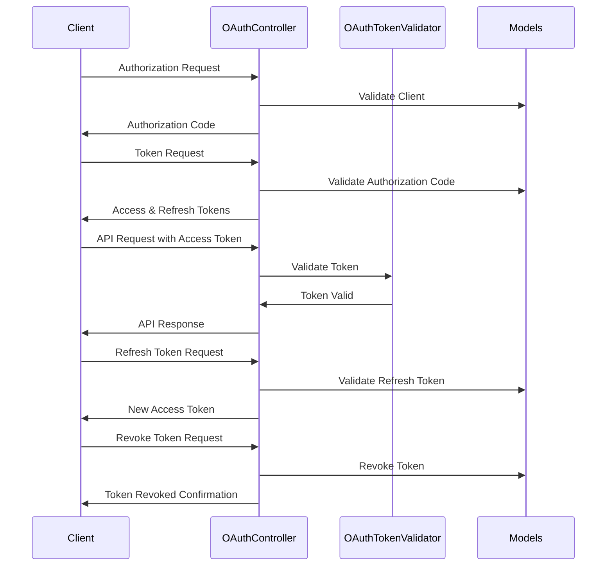

# Custom OAuth 2.0 Server Implementation Documentation

## Overview

This Rails application implements a custom OAuth 2.0 authorization server. It provides authentication and authorization services for client applications, focusing on secure token management and flexible OAuth 2.0 flows.

## Key Components

1. OAuthController
2. OAuthTokenValidator (Middleware)
3. ErrorHandler (Concern)
4. OAuthClient (Model)
5. OAuthAccessToken (Model)
6. OAuthRefreshToken (Model)
7. AuthorizationCode (Model)
8. Scope (Model)
9. User (Model)

## Authentication Flow

## Detailed Process Description

### 1. Authorization Request
- Client initiates the flow by sending a request to `/api/v1/oauth/authorize`.
- OAuthController validates the client and generates an authorization code.

### 2. Token Request
- Client exchanges the authorization code for tokens at `/api/v1/oauth/token`.
- OAuthController validates the code and issues access and refresh tokens.

### 3. API Access
- Client uses the access token to make authenticated requests.
- OAuthTokenValidator middleware validates the token for each request.

### 4. Token Refresh
- When the access token expires, the client can use the refresh token to get a new access token.
- This is handled by the token endpoint with a 'refresh_token' grant type.

### 5. Token Revocation
- Clients can revoke tokens using the `/api/v1/oauth/revoke` endpoint.

## Key Classes and Their Responsibilities

### OAuthController
- Handles all OAuth-related endpoints (authorize, token, revoke).
- Manages the overall flow of the OAuth process.

### OAuthTokenValidator (Middleware)
- Validates access tokens for protected routes.
- Checks token authenticity and expiration.

### ErrorHandler (Concern)
- Centralizes error handling for OAuth-related errors.
- Provides consistent error responses across the application.

### OAuthClient (Model)
- Represents OAuth clients authorized to use the OAuth server.
- Stores client_id, client_secret, and redirect_uri.

### OAuthAccessToken (Model)
- Represents access tokens issued to clients.
- Includes token string, expiration time, and associations to client and user.

### OAuthRefreshToken (Model)
- Represents refresh tokens issued to clients.
- Used to obtain new access tokens without re-authentication.

### AuthorizationCode (Model)
- Represents temporary authorization codes used in the OAuth flow.

### Scope (Model)
- Manages the available scopes for access control.

### User (Model)
- Represents end-users of the system.
- Includes authentication logic and associations with tokens.

## Security Measures

1. PKCE (Proof Key for Code Exchange) support for public clients.
2. JWT encoding for access tokens (to be implemented).
3. Refresh token rotation (to be implemented).
4. Rate limiting using rack-attack (configured in config/initializers/rack_attack.rb).
5. CORS configuration to control cross-origin requests (configured in config/initializers/cors.rb).

## Error Handling

Custom error handling is implemented through the ErrorHandler concern, providing consistent error responses for OAuth-related issues.

## Configuration

- CORS settings: config/initializers/cors.rb
- Rack Attack settings: config/initializers/rack_attack.rb

## Future Enhancements

1. Implement JWT encoding for access tokens.
2. Add refresh token rotation for enhanced security.
3. Implement additional grant types (e.g., client credentials, password).
4. Enhance scope support for more fine-grained access control.
5. Add support for dynamic client registration.

## Related Files

- app/controllers/api/v1/oauth_controller.rb
- app/middleware/oauth_token_validator.rb
- app/controllers/concerns/error_handler.rb
- app/models/o_auth_client.rb
- app/models/o_auth_access_token.rb
- app/models/o_auth_refresh_token.rb
- app/models/authorization_code.rb
- app/models/scope.rb
- app/models/user.rb
- config/routes.rb
- config/initializers/cors.rb
